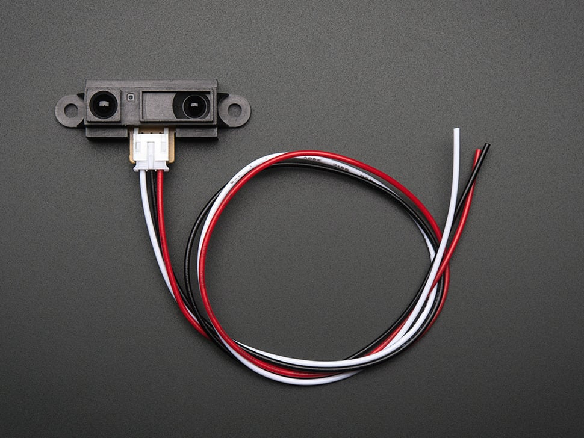
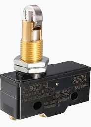

# Hardware - Components & Sensors Guide

Welcome to our comprehensive guide on hardware components and sensors used on our FRC team. This page serves as an educational resource for our team members, providing insights into the capabilities and applications of various robotic components. Whether you're designing a new robot or optimizing an existing one, understanding these components will enhance your engineering decisions.

## Motors

### NEO Motor

    

The NEO Motor is a high-performance brushless motor renowned for its efficiency and power. It incorporates an integrated encoder, enabling precise readings of the motor's angle and speed. With a maximum speed of 5588 RPM, its optimal performance is achieved around 3000 RPM.
??? abstract "When to use" 
    Ideal for any design component requiring motion, providing both power and control.

### NEO 550 Motor

    

A compact variant of the NEO Motor, the NEO 550 is lightweight yet powerful. Its small form factor makes it perfect for applications where weight or space is a constraint.
??? abstract "When to use"  
    Use when designing systems that need to be compact or have limited space without compromising on power.

## Sensors

!!! question "Digital vs. Analog"
    **Digital Sensors** are simple in design, they output a binary value, 0 or 1, indicating off or on states. An example is a light switch.
    **Analog Sensors** are more complex, these sensors provide a range of values, offering nuanced control and feedback. A dimming switch is a typical example.

#### Infared (IR) Sensor

    

- **Type**: Digital Sensor
- **Capabilities/Uses**: Detects infrared radiation from objects, useful for sensing within 10cm to 150cm. Variability in detection range depends on the sensor type.
??? note "Past exmaple" 
    We used an IR sensor on our 2023 robot, Kelvin, for cube intake detection.

#### Ultrasonic Sensor

    

- **Type**: Analog Sensor
- **Capabilities**: Employs high-frequency sound waves to measure distances by calculating the time it takes for echoes to return. Ideal for detecting the distance from objects, ensuring spatial awareness.

#### Color Sensor

    

- **Type**: Analog Sensor
- **Capabilities**: Measures object colors by analyzing reflected light. Though not crucial for this year's application, it's valuable for tasks requiring color differentiation. Illuminates an object and analyzes the reflected light's intensity and wavelength.

#### Inductive Proximity Sensor

    

- **Type**: Digital Sensor
- **Capabilities**: Detects metallic objects without contact, using electromagnetic induction.
??? note "Past exmaple" 
    We used an Inductive Proximity Sensor on Kelvin (2023). It determined the arm's home position.

#### Capacitive Proximity Sensor

    

- **Type**: Digital Sensor
- **Capabilities**: Senses non-metallic objects through changes in an electrostatic field, useful for proximity detection without direct contact.

### Limit Switches

**General Use**: Detects the presence or absence of an object, or a specific position, to prevent mechanism overextension.

=== "Lever Switch"
    

        
    

    Lightweight option for simple detection tasks.

=== "Plunger Switch"
    

        
    
  
    Durable and capable of withstanding significant force. Used in Jankins (2022).

=== "Refrigerator Switch"
    

        
    

    Offers high durability. Employed in Kelvin (2023) for robust applications.

